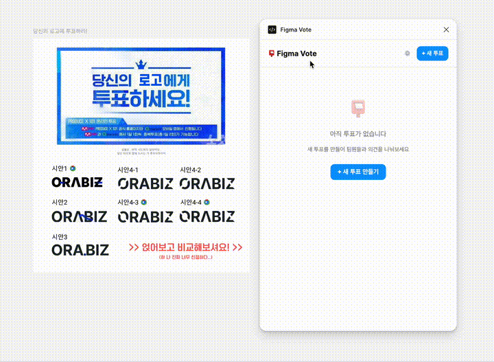

<p align="center">
  
</p>

<h1 align="center">Figma Vote</h1>

<p align="center">
  <strong>Figma 안에서 바로 투표하세요.</strong><br/>
  디자인 시안 비교, 설문조사, 리액션 투표를 하나의 플러그인으로.
</p>

<p align="center">
  
  
  
</p>

---

<p align="center">
  
</p>

---

## Features

| 기능 | 설명 |
|------|------|
| **설문 투표** | 커스텀 질문과 선택지로 팀 의견 수집 |
| **디자인 시안 투표** | 캔버스에서 프레임을 선택하고 A안/B안 비교 투표 |
| **리액션 투표** | 이모지 기반 빠른 리액션 |
| **웹 링크 공유** | 플러그인 없이도 브라우저에서 투표 가능 |
| **실시간 결과** | 투표 현황을 바로 확인 |

## How it works

```
Figma Plugin ──── create vote ────▶ Cloudflare Worker (KV)
                                          │
Team member ◀── share link ───────────────┘
                                          │
Browser     ──── cast vote ───────▶ Cloudflare Worker (KV)
                                          │
Figma Plugin ◀── refresh ────────────────┘
```

1. 플러그인에서 투표를 만들면 Cloudflare Worker에 저장됩니다.
2. 생성된 **공유 링크**를 팀원에게 보내면, 브라우저에서 바로 투표할 수 있습니다.
3. 플러그인에서 새로고침하면 웹 투표 결과까지 모두 확인됩니다.

> Worker 없이도 **로컬 모드**로 동작합니다. (같은 Figma 파일 내에서만 투표 가능)

## Getting Started

### 1. 플러그인 설치

```bash
git clone https://github.com/your-username/figma-vote.git
cd figma-vote
npm install
npm run build
```

Figma 데스크탑 앱에서:
- **Plugins → Development → Import plugin from manifest...**
- 프로젝트 루트의 `manifest.json` 선택

### 2. Worker 배포 (선택)

> 웹 링크 공유 기능을 사용하려면 Cloudflare Worker를 배포해야 합니다.

```bash
# Cloudflare 계정 로그인
npx wrangler login

# KV 네임스페이스 생성
npx wrangler kv namespace create VOTES
```

출력된 `id`를 `worker/wrangler.toml`에 붙여넣기:

```toml
[[kv_namespaces]]
binding = "VOTES"
id = "여기에_출력된_ID_붙여넣기"
```

배포:

```bash
cd worker
npm install
npx wrangler deploy
```

배포 후 출력되는 URL(예: `https://figma-vote.xxx.workers.dev`)을 플러그인 설정(⚙️)에 입력하면 완료!

### 3. 사용하기

1. Figma에서 플러그인 실행
2. **+ 새 투표** 클릭
3. 투표 유형 선택 (설문 / 디자인 / 리액션)
4. 생성된 링크를 팀원에게 공유
5. 결과 확인은 플러그인 또는 웹에서

## Project Structure

```
figma-vote/
├── manifest.json          # Figma plugin manifest
├── package.json
├── scripts/
│   └── build.mjs          # esbuild config
├── src/
│   ├── code.ts            # Plugin sandbox code
│   └── ui/
│       ├── index.html     # UI template
│       ├── main.ts        # UI logic
│       └── styles.css     # UI styles
├── worker/
│   ├── wrangler.toml      # Cloudflare Worker config
│   ├── package.json
│   └── src/
│       └── index.ts       # Worker API + vote web page
└── assets/
    └── logo.svg
```

## Tech Stack

- **Plugin**: TypeScript, Figma Plugin API
- **Backend**: Cloudflare Workers + KV (serverless, free tier)
- **Build**: esbuild
- **UI**: Vanilla HTML/CSS/JS (no framework, lightweight)

## Development

```bash
# 개발 모드 (파일 변경 시 자동 빌드)
npm run watch

# Worker 로컬 테스트
cd worker
npx wrangler dev
```

## Cost

**무료**입니다. Cloudflare Workers 무료 티어:

| 항목 | 무료 한도 |
|------|----------|
| 요청 수 | 100,000 / day |
| KV 읽기 | 100,000 / day |
| KV 쓰기 | 1,000 / day |

팀 내 투표 용도로는 충분합니다.

## Contributing

기여를 환영합니다! Issue를 올리거나 Pull Request를 보내주세요.

1. Fork this repository
2. Create your feature branch (`git checkout -b feature/amazing-feature`)
3. Commit your changes (`git commit -m 'Add amazing feature'`)
4. Push to the branch (`git push origin feature/amazing-feature`)
5. Open a Pull Request

## License

[MIT](LICENSE)

---

<p align="center">
  Made with ❤️ for designers who want a voice.
</p>
